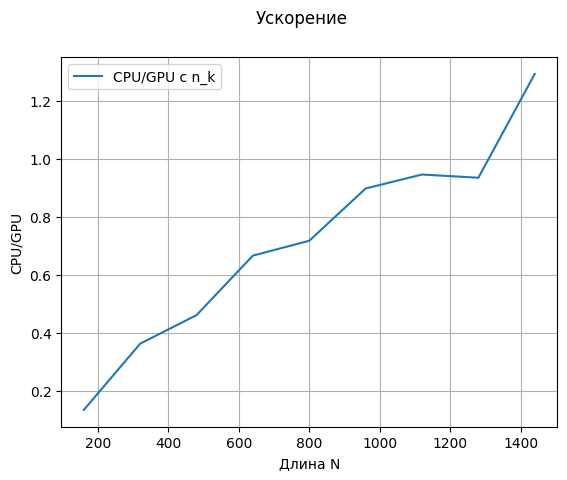
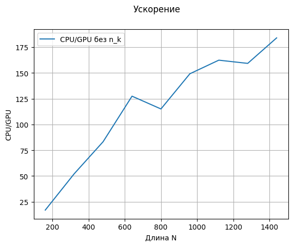

# Lab №3 - Mass search

## Задание

__Задача__: Реализовать массовый поиск подстрок на GPU и на CPU
## Описание
__Предобработка символов алфавита__: Создаётся словарь с ключами - элементами алфавита и значениями - (n, k),
где n - индекс подстроки N[n], k - индекс символа в подстроке N[n]. Для каждого N[n, k] в словарь для соответствующего символа заносится кортеж (n, k).

__GPU реализация__: Каждый поток с абс. индексами x и y рассматривает каждый символ N[y]-подстроки для H[x] символа входного буфера. 
Если символ подстроки с индексом k совпал с символом H[x], то R[y, x - k] элемент рабочей матрицы декрементируется.

__CPU реализация без использования (n,k)__: Пробегаемся по каждому элементу (i, j) рабочей матрицы R и, если k-ый символ подстроки N[i] совпал с H[j], 
декрементируем значение R[i, j - k].

__CPU реализация с использованием (n,k)__: Пробегаемся по каждому символу входного буффера H, получаем вхождения (n, k) этого символа в подстроки.
Для каждого (n, k) декрементируем значение R[n, i - k].

Производился подсчёт среднего времени вычислений трёх реализаций, результаты которых представлены на графиках и в таблице.

## Графики

## Таблица
<table border="0" cellpadding="0" cellspacing="0" id="sheet0" class="sheet0 gridlines">
    <col class="col0">
    <col class="col1">
    <col class="col2">
    <col class="col3">
    <col class="col4">
    <col class="col5">
    <col class="col6">
    <col class="col7">
    <col class="col8">
    <tbody>
      <tr class="row0">
        <td class="column0">&nbsp;</td>
        <td class="column1 style1 s">Длина N</td>
        <td class="column2 style1 s">Длина H</td>
        <td class="column3 style1 s">GPU</td>
        <td class="column4 style1 s">CPU без n_k</td>
        <td class="column5 style1 s">CPU/GPU без n_k</td>
        <td class="column6 style1 s">CPU с n_k</td>
        <td class="column7 style1 s">CPU/GPU с n_k</td>
        <td class="column8 style1 s">Одиннаковые значения</td>
      </tr>
      <tr class="row1">
        <td class="column0 style1 n">160</td>
        <td class="column1 style0 n">160</td>
        <td class="column2 style0 n">160</td>
        <td class="column3 style0 n">0.002653</td>
        <td class="column4 style0 n">0.045085</td>
        <td class="column5 style0 n">16.991015</td>
        <td class="column6 style0 n">0.000358</td>
        <td class="column7 style0 n">0.134814</td>
        <td class="column8 style0 b">1</td>
      </tr>
      <tr class="row2">
        <td class="column0 style1 n">320</td>
        <td class="column1 style0 n">320</td>
        <td class="column2 style0 n">320</td>
        <td class="column3 style0 n">0.002482</td>
        <td class="column4 style0 n">0.129493</td>
        <td class="column5 style0 n">52.173032</td>
        <td class="column6 style0 n">0.000902</td>
        <td class="column7 style0 n">0.363298</td>
        <td class="column8 style0 b">1</td>
      </tr>
      <tr class="row3">
        <td class="column0 style1 n">480</td>
        <td class="column1 style0 n">480</td>
        <td class="column2 style0 n">480</td>
        <td class="column3 style0 n">0.003826</td>
        <td class="column4 style0 n">0.318638</td>
        <td class="column5 style0 n">83.277712</td>
        <td class="column6 style0 n">0.001767</td>
        <td class="column7 style0 n">0.461775</td>
        <td class="column8 style0 b">1</td>
      </tr>
      <tr class="row4">
        <td class="column0 style1 n">640</td>
        <td class="column1 style0 n">640</td>
        <td class="column2 style0 n">640</td>
        <td class="column3 style0 n">0.004759</td>
        <td class="column4 style0 n">0.606475</td>
        <td class="column5 style0 n">127.432362</td>
        <td class="column6 style0 n">0.003174</td>
        <td class="column7 style0 n">0.666934</td>
        <td class="column8 style0 b">1</td>
      </tr>
      <tr class="row5">
        <td class="column0 style1 n">800</td>
        <td class="column1 style0 n">800</td>
        <td class="column2 style0 n">800</td>
        <td class="column3 style0 n">0.004236</td>
        <td class="column4 style0 n">0.487400</td>
        <td class="column5 style0 n">115.052835</td>
        <td class="column6 style0 n">0.003042</td>
        <td class="column7 style0 n">0.718061</td>
        <td class="column8 style0 b">1</td>
      </tr>
      <tr class="row6">
        <td class="column0 style1 n">960</td>
        <td class="column1 style0 n">960</td>
        <td class="column2 style0 n">960</td>
        <td class="column3 style0 n">0.005472</td>
        <td class="column4 style0 n">0.816108</td>
        <td class="column5 style0 n">149.155151</td>
        <td class="column6 style0 n">0.004915</td>
        <td class="column7 style0 n">0.898289</td>
        <td class="column8 style0 b">1</td>
      </tr>
      <tr class="row7">
        <td class="column0 style1 n">1120</td>
        <td class="column1 style0 n">1120</td>
        <td class="column2 style0 n">1120</td>
        <td class="column3 style0 n">0.006613</td>
        <td class="column4 style0 n">1.073606</td>
        <td class="column5 style0 n">162.338699</td>
        <td class="column6 style0 n">0.006259</td>
        <td class="column7 style0 n">0.946464</td>
        <td class="column8 style0 b">1</td>
      </tr>
      <tr class="row8">
        <td class="column0 style1 n">1280</td>
        <td class="column1 style0 n">1280</td>
        <td class="column2 style0 n">1280</td>
        <td class="column3 style0 n">0.008532</td>
        <td class="column4 style0 n">1.358554</td>
        <td class="column5 style0 n">159.229111</td>
        <td class="column6 style0 n">0.007980</td>
        <td class="column7 style0 n">0.935330</td>
        <td class="column8 style0 b">1</td>
      </tr>
      <tr class="row9">
        <td class="column0 style1 n">1440</td>
        <td class="column1 style0 n">1440</td>
        <td class="column2 style0 n">1440</td>
        <td class="column3 style0 n">0.010188</td>
        <td class="column4 style0 n">1.874127</td>
        <td class="column5 style0 n">183.949084</td>
        <td class="column6 style0 n">0.013177</td>
        <td class="column7 style0 n">1.293302</td>
        <td class="column8 style0 b">1</td>
      </tr>
    </tbody>
</table>

## Вывод
Выполнение массового поиска подстрок стандартным средствами на Python заметно уступает распараллеленной версии с помощью numba.
Использование предобработки (n,k) заметно ускорило CPU-реализацию, 
но даже не смотря на передачу данных, в GPU-реализации оказалась быстрее благодаря большому количеству потоков.
