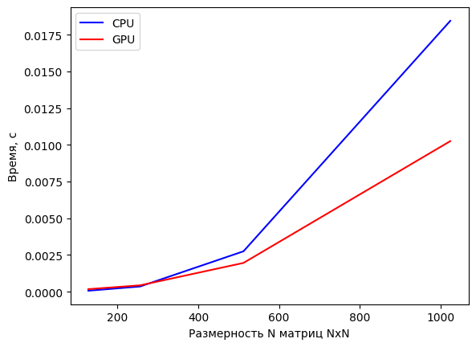
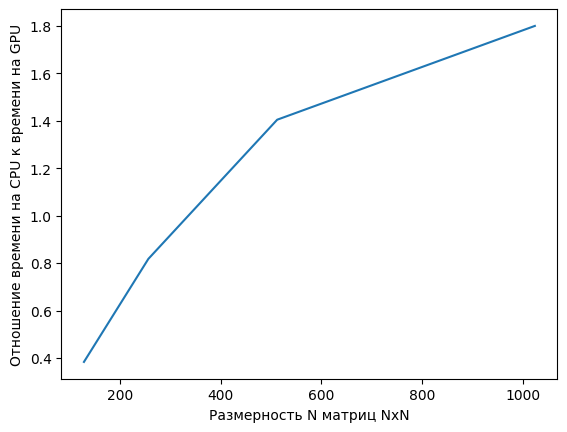

# Lab №0 - Matrix Multiplication
## Gresko Pavel 6132-010402D

## Задание

__Задача__: реализовать алгоритм перемножения матриц

__Язык__: C++ или Python

__Входные данные__: 2 матрицы размером от 100х100 до 2000х2000 каждая.

__Выходные данные__: проверка корректности перемножения + время вычисления

__Реализация должна содержать 2 функции перемножения матриц__: на CPU и на GPU с
применением CUDA.

__Отчет о проделанной лабораторной работе__ - это git-репозиторий с исходным кодом реализации + описание проделанной работы там же в readme.
Необходимо описать реализацию, объяснив, что конкретно было распараллелено и почему.

__Провести эксперименты__: перемножить матрицы разных размеров, посчитать ускорение. Результаты привести в виде таблицы/графика.

## Описание
Функция перемножения квадратных матриц __на GPU__ представлена в виде строкового параметра с кодом на C++, который заносится в компилятор библиотеки __pycuda__.

Функция перемножения квадратных матриц __на CPU__ представлена в виде функции __dot__ библиотеки __numpy__.

Вызов данных функций осуществляется ***count_iteration*** раз для каждой размерности (***sizes***) с замером среднего времени выполнения с помощь библиотеки __time__.

Матрицы заполняются случайными дробными числами с нормальным распределением, выделяется память для всех трёх матриц на CPU и на GPU. Подсчёт количества нитей для выполнения на GPU выполняется точным покрытием размерности матрицы количеством варпов (__warp__). Каждый варп состоит из 32 нитей, каждый блок, в моём случае, имеет максимальный размер 1024 нити (32 варпа), сетка блоков может содержать более 4 миллиардов блоков.

Проверка вычислений осуществляется сравнением соответствующих элементов матрицы с допустимой погрешностью ***epsilon*** с помощью функции __allclose__ библиотеки __numpy__.

## Графики

## Таблица
<table border="0" cellpadding="0" cellspacing="0" id="sheet0" class="sheet0 gridlines">
<col class="col0">
<col class="col1">
<col class="col2">
<tbody>
<tr class="row0">
<td class="column0 style2 s">Shape</td>
<td class="column1 style1 s">CPU</td>
<td class="column2 style1 s">GPU</td>
</tr>
<tr class="row1">
<td class="column0 style1 n">128</td>
<td class="column1 style3 n">0.000067</td>
<td class="column2 style3 n">0.000174</td>
</tr>
<tr class="row2">
<td class="column0 style1 n">256</td>
<td class="column1 style3 n">0.000354</td>
<td class="column2 style3 n">0.000433</td>
</tr>
<tr class="row3">
<td class="column0 style1 n">512</td>
<td class="column1 style3 n">0.002750</td>
<td class="column2 style3 n">0.001959</td>
</tr>
<tr class="row4">
<td class="column0 style1 n">1024</td>
<td class="column1 style3 n">0.018445</td>
<td class="column2 style3 n">0.010253</td>
</tr>
</tbody>
</table>

## Вывод
На малых количествах данных CUDA проигрывает CPU_реализации из-за затрат времени на пересылку данных. Однако на больших массивах данных CUDA заметно ускоряет процесс вычислений за счёт распараллеливания операций на большом количестве нитей. 
