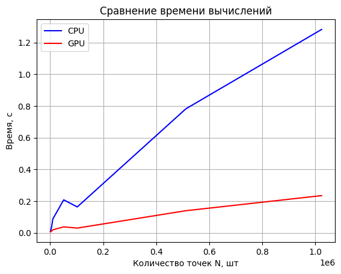
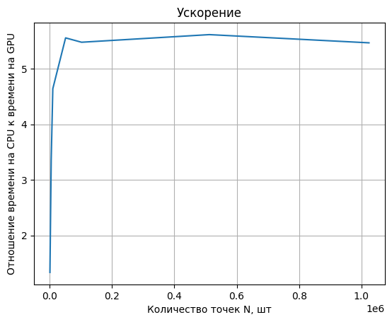

# Pi Calculator (Monte Carlo)

## Задание

__Задача__: Реализовать две функции рассчёта числа Пи на CPU и на GPU **(библиотека numba)**

## Описание
Для параллелного вычисления числа Пи используется библиотека numba с генерацией случайного числа от 0 до 1 с помощью [xoroshiro128p](https://numba.pydata.org/numba-doc/0.41.0/cuda/random.html).

Функция вычисления Пи на GPU представлена функцией *gpu_pi_calculating*, в которой каждая нить генерирует координаты точки (x, y) и при соблюдении условия 
**(x^2 +y^2 < 1)** увеличивает параметр суммы на коэффициент **4/N**. Количество нитей соответствует числу точек.

Функция вычисления Пи на CPU аналогична функции на GPU, но в последовательном варианте.

В представленной ниже таблице представлены средние значений времени вычислений, отклонения подсчитанного числа Пи от истинного и значение числа Пи на последней итерации повторения (11 повторений).

## Графики

## Таблица
<table border="0" cellpadding="0" cellspacing="0" id="sheet0" class="sheet0 gridlines">
    <col class="col0">
    <col class="col1">
    <col class="col2">
    <col class="col3">
    <col class="col4">
    <col class="col5">
    <col class="col6">
    <col class="col7">
    <tbody>
      <tr class="row0">
        <td class="column0">&nbsp;</td>
        <td class="column1 style1 s">Размерности</td>
        <td class="column2 style1 s">CPU:Среднее время</td>
        <td class="column3 style1 s">GPU:Среднее время</td>
        <td class="column4 style1 s">CPU:Среднее отклонение</td>
        <td class="column5 style1 s">GPU:Среднее отклонение</td>
        <td class="column6 style1 s">CPU:Последнее значение pi</td>
        <td class="column7 style1 s">GPU:Последнее значение pi</td>
      </tr>
      <tr class="row1">
        <td class="column0 style1 n">0</td>
        <td class="column1 style0 n">1024</td>
        <td class="column2 style0 n">0.008483</td>
        <td class="column3 style0 n">0.006361</td>
        <td class="column4 style0 n">0.050338</td>
        <td class="column5 style0 n">0.028311</td>
        <td class="column6 style0 n">3.148438</td>
        <td class="column7 style0 n">3.113281</td>
      </tr>
      <tr class="row2">
        <td class="column0 style1 n">1</td>
        <td class="column1 style0 n">5120</td>
        <td class="column2 style0 n">0.034167</td>
        <td class="column3 style0 n">0.010171</td>
        <td class="column4 style0 n">0.019836</td>
        <td class="column5 style0 n">0.027412</td>
        <td class="column6 style0 n">3.117969</td>
        <td class="column7 style0 n">3.114181</td>
      </tr>
      <tr class="row3">
        <td class="column0 style1 n">2</td>
        <td class="column1 style0 n">10240</td>
        <td class="column2 style0 n">0.087663</td>
        <td class="column3 style0 n">0.018893</td>
        <td class="column4 style0 n">0.009500</td>
        <td class="column5 style0 n">0.035917</td>
        <td class="column6 style0 n">3.117578</td>
        <td class="column7 style0 n">3.105675</td>
      </tr>
      <tr class="row4">
        <td class="column0 style1 n">3</td>
        <td class="column1 style0 n">51200</td>
        <td class="column2 style0 n">0.207815</td>
        <td class="column3 style0 n">0.037412</td>
        <td class="column4 style0 n">0.004761</td>
        <td class="column5 style0 n">0.007138</td>
        <td class="column6 style0 n">3.143359</td>
        <td class="column7 style0 n">3.134455</td>
      </tr>
      <tr class="row5">
        <td class="column0 style1 n">4</td>
        <td class="column1 style0 n">102400</td>
        <td class="column2 style0 n">0.163347</td>
        <td class="column3 style0 n">0.029827</td>
        <td class="column4 style0 n">0.003613</td>
        <td class="column5 style0 n">0.004474</td>
        <td class="column6 style0 n">3.136953</td>
        <td class="column7 style0 n">3.137118</td>
      </tr>
      <tr class="row6">
        <td class="column0 style1 n">5</td>
        <td class="column1 style0 n">512000</td>
        <td class="column2 style0 n">0.782121</td>
        <td class="column3 style0 n">0.139327</td>
        <td class="column4 style0 n">0.001603</td>
        <td class="column5 style0 n">0.013734</td>
        <td class="column6 style0 n">3.144945</td>
        <td class="column7 style0 n">3.155327</td>
      </tr>
      <tr class="row7">
        <td class="column0 style1 n">6</td>
        <td class="column1 style0 n">1024000</td>
        <td class="column2 style0 n">1.282631</td>
        <td class="column3 style0 n">0.234657</td>
        <td class="column4 style0 n">0.001129</td>
        <td class="column5 style0 n">0.017745</td>
        <td class="column6 style0 n">3.142109</td>
        <td class="column7 style0 n">3.123848</td>
      </tr>
    </tbody>
</table>

## Вывод
Вычисление числа Пи методом Монте Карло стандартным средствами на Python заметно уступает распараллеленной версии с помощь numba.
Причиной этого может служить тот факт, что случайные числа генерировались на самом GPU, тем самым затраты на передачу данных сведены к минимуму.