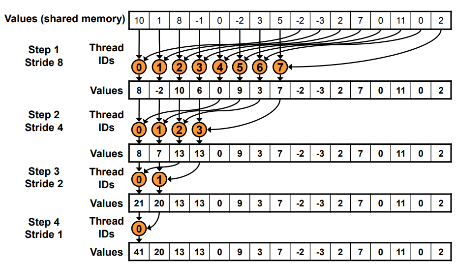
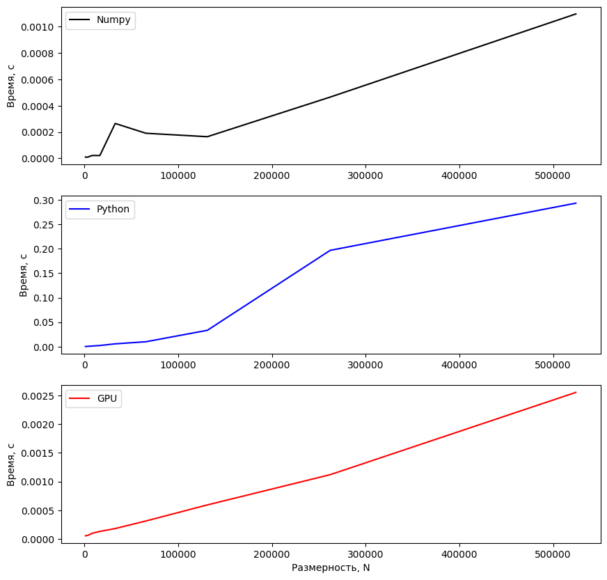
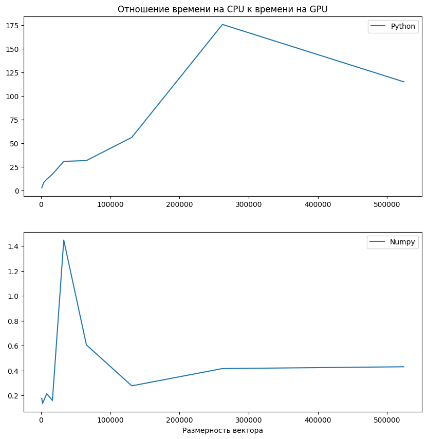

# Lab №1 - Vector Reduction
## Задание

__Задача__: реализовать алгоритм сложения элементов вектора

__Язык__: C++ или Python

__Входные данные__: Вектор размером 1 000..1 000 000 значений.

__Выходные данные__: сумма элементов вектора + время вычисления

__Реализация должна содержать 2 функции перемножения матриц__: 2 функции сложения элементов вектора: на CPU и на
GPU с применением CUDA.

__Отчет о проделанной лабораторной работе__ - это git-репозиторий с исходным кодом реализации + описание проделанной работы там же в readme.
Необходимо описать реализацию, объяснив, что конкретно было распараллелено и почему.

__Провести эксперименты__:  получить сумму векторов разных размеров (провести 5 или более экспериментов), посчитать ускорение. Результаты привести в виде таблицы/графика.

## Описание
Функция параллельного суммирования вектора __на GPU__ представлена в виде строкового параметра с кодом на C++, который заносится в компилятор библиотеки __pycuda__. Полный разбор редукции вектора на CUDA представлен в источнике: https://developer.download.nvidia.com/assets/cuda/files/reduction.pdf

Операции суммирования вектора __на CPU__ представлены в виде двух функции: __sum__ библиотеки __numpy__ и стандартной функции __sum__ языка __Python__.

Вызов данных функций осуществляется ***count_iteration*** раз для каждой размерности (***sizes***) с замером среднего времени выполнения с помощь библиотеки __time__.

Вектор заполняется единицами для удобной проверки суммирования, выделяется память для исходного и результирующего векторов на CPU и на GPU. Подсчёт количества нитей для выполнения на GPU выполняется точным покрытием размерности вектора, поделённого пополам.

## Графики

## Таблица
<table border="0" cellpadding="0" cellspacing="0" id="sheet0" class="sheet0 gridlines">
    <col class="col0">
    <col class="col1">
    <col class="col2">
    <col class="col3">
    <tbody>
        <tr class="row0">
        <td class="column0">&nbsp;</td>
        <td class="column1 style1 s">Numpy</td>
        <td class="column2 style1 s">Python</td>
        <td class="column3 style1 s">GPU</td>
        </tr>
        <tr class="row1">
        <td class="column0 style1 n">1024</td>
        <td class="column1 style0 n">0.000010</td>
        <td class="column2 style0 n">0.000149</td>
        <td class="column3 style0 n">0.000058</td>
        </tr>
        <tr class="row2">
        <td class="column0 style1 n">2048</td>
        <td class="column1 style0 n">0.000008</td>
        <td class="column2 style0 n">0.000286</td>
        <td class="column3 style0 n">0.000058</td>
        </tr>
        <tr class="row3">
        <td class="column0 style1 n">4096</td>
        <td class="column1 style0 n">0.000011</td>
        <td class="column2 style0 n">0.000569</td>
        <td class="column3 style0 n">0.000067</td>
        </tr>
        <tr class="row4">
        <td class="column0 style1 n">8192</td>
        <td class="column1 style0 n">0.000022</td>
        <td class="column2 style0 n">0.001178</td>
        <td class="column3 style0 n">0.000101</td>
        </tr>
        <tr class="row5">
        <td class="column0 style1 n">16384</td>
        <td class="column1 style0 n">0.000021</td>
        <td class="column2 style0 n">0.002249</td>
        <td class="column3 style0 n">0.000132</td>
        </tr>
        <tr class="row6">
        <td class="column0 style1 n">32768</td>
        <td class="column1 style0 n">0.000265</td>
        <td class="column2 style0 n">0.005602</td>
        <td class="column3 style0 n">0.000183</td>
        </tr>
        <tr class="row7">
        <td class="column0 style1 n">65536</td>
        <td class="column1 style0 n">0.000190</td>
        <td class="column2 style0 n">0.009899</td>
        <td class="column3 style0 n">0.000314</td>
        </tr>
        <tr class="row8">
        <td class="column0 style1 n">131072</td>
        <td class="column1 style0 n">0.000164</td>
        <td class="column2 style0 n">0.033260</td>
        <td class="column3 style0 n">0.000594</td>
        </tr>
        <tr class="row9">
        <td class="column0 style1 n">262144</td>
        <td class="column1 style0 n">0.000465</td>
        <td class="column2 style0 n">0.196768</td>
        <td class="column3 style0 n">0.001120</td>
        </tr>
        <tr class="row10">
        <td class="column0 style1 n">524288</td>
        <td class="column1 style0 n">0.001097</td>
        <td class="column2 style0 n">0.293258</td>
        <td class="column3 style0 n">0.002551</td>
        </tr>
    </tbody>
</table>

## Вывод
Вычисление суммы вектора значений на языке Python выгоднее всего выполнять при помощи операции sum библиотеки __numpy__. Реализация на __CUDA__ проигрывает реализации от numpy, но существенно выигрывает у стандартной функции __sum__ языка __Python__.